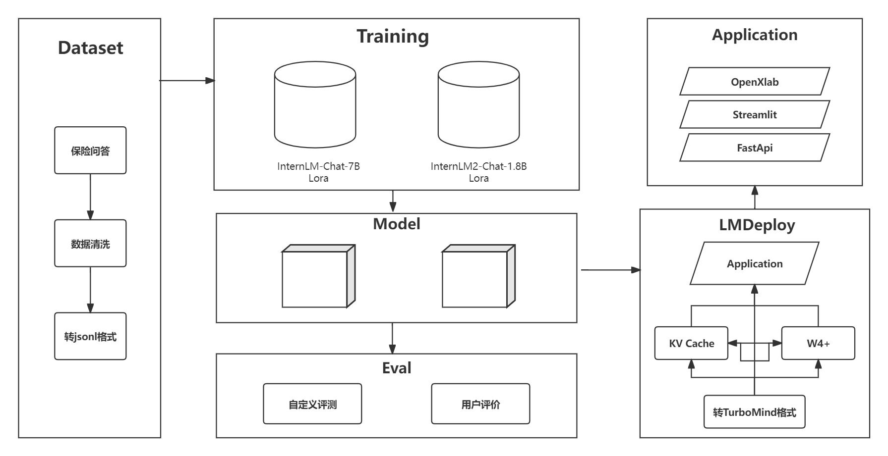
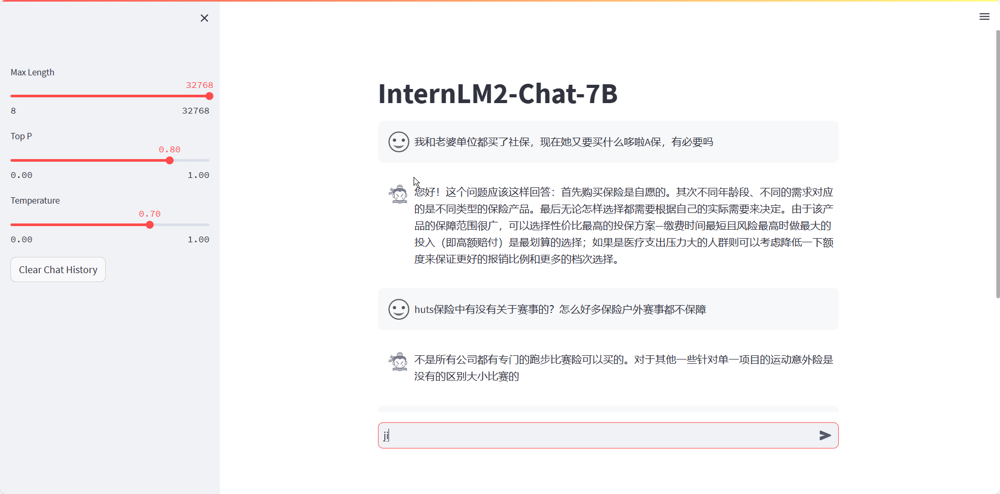
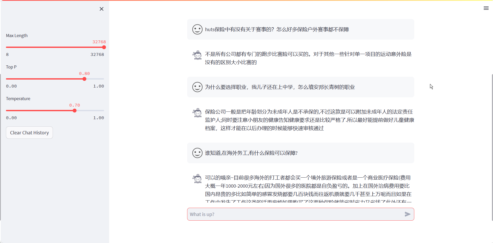

# 保险知识问答助手

## 介绍

​	欢迎使用我们的保险知识问答大语言模型！这个模型是基于`ChineseNlpCorpus`提供的丰富保险领域数据集开发而成。我们的数据集涵盖了用户的各种保险相关提问、网友的回答以及最佳回答，旨在为您提供全面、准确的保险知识解答。

​	我们的模型是您在保险领域的智囊团，具备丰富的专业知识和应用能力。无论您是想了解保险的基本概念、不同类型的保险，还是需要指导理赔流程或选择合适的保险政策，我们都能为您提供帮助。

具体如何实现全流程的 chat-AI 微调，可参考本仓库[meowcao/InsuranceModel: 基于internlm-chat-7b的保险知识大模型微调 (github.com)](https://github.com/meowcao/InsuranceModel?tab=readme-ov-file)

如何学习大模型部署和微调请参考：[开源大模型食用指南](https://github.com/datawhalechina/self-llm.git) 以及 [书生·浦语大模型实战营课程](https://github.com/InternLM/tutorial.git)



## OpenXlab 模型

保险知识问答助手使用的是InternLM 的 7B 模型，模型参数量为 7B，模型已上传，可以直接下载推理。

| 基座模型         | 微调数据量          | 训练次数 | 下载地址 |
| ---------------- | ------------------- | -------- | -------- |
| InternLM-chat-7b | 46933 conversations | 5 epochs |          |

## 数据集

​	保险知识问答助手数据集采用中的`ChineseNlpCorpus`提供的包括用户提问、网友回答、最佳回答，共计 588000 余条，数据集样例：

```
"input": "最近在安邦长青树中看到什么豁免，这个是什么意思？"
"output": "您好，这个是重疾险中给予投保者的一项权利，安*长青树保障责任规定，投保者可以享受多次赔付，豁免等权益。也就是说不同轻症累计5次赔付，理赔1次轻症豁免后期所交保费，人性化的设计，无需加保费。"
"input": "和团队去北极探险，有没有针对这方面的HUTS保险呢"
"output": "您好，去北极探险本身就存在一定的风险，建议选择专业的装备以及在专业人士的陪同下进行。至于保险，市面上关于此类的保险并不多，不过HUTS保险中却有一款专门针对南北极旅游的定制产品，保障内容充足，户外伤害、医疗保障甚至的紧急救援都具备，详情可以多了解下。"
```

### 数据处理与整理

1. 数据集是以CSV格式存储的，第一行为列名，分别为 `title`, `reply`, `is_best`。
2. 数据集把数据分类为优质回答（is_best=1）与劣质回答（is_best=0），需要过滤掉 `is_best` 列为0的数据。

使用如下脚本文件


```python
import csv
import json

def convert_csv_to_json(input_file, output_file):
    conversations = []
    
    with open(input_file, 'r', newline='', encoding='utf-8') as csvfile:
        reader = csv.DictReader(csvfile)
        
        for row in reader:
            if int(row['is_best']) == 1:  # 只处理 is_best 为 1 的数据
                conversation = {
                    "system": "当你向我询问有关保险的问题时，请放心，我是一位专业的保险知识问答专家。我可以帮助您澄清保险的基本概念和作用，解释不同类型保险的特点，以及回答关于保险合同、理赔流程或保险政策的任何问题。您可以随时向我提出关于健康、车辆、房屋和人寿保险等方面的疑问。如果您想了解如何提出保险理赔申请或需要关于保险理赔流程的详细信息，请告诉我，我将为您提供专业的指导和建议。",
                    "input": row['title'],
                    "output": row['reply']
                }
                conversations.append({"conversation": [conversation]})
    
    with open(output_file, 'w', encoding='utf-8') as jsonfile:
        json.dump(conversations, jsonfile, ensure_ascii=False, indent=4)

# 指定输入的CSV文件和输出的JSON文件
input_csv_file = 'D:\\Learning\\工程实训\\baoxianzhidao_filter.csv'
output_json_file = 'D:\\Learning\\工程实训\\output.json'

# 调用函数进行转换
convert_csv_to_json(input_csv_file, output_json_file)

print(f"转换完成，结果已保存到 {output_json_file}")

```

- `convert_csv_to_json` 函数负责读取CSV文件，过滤和转换数据，并将结果写入JSON文件。
- 我们使用 `csv.DictReader` 来读取CSV文件，并以字典形式访问每一行的数据。
- 对于每一行数据，根据 `is_best` 的值决定是否添加到最终的JSON输出中。
- 最后，使用 `json.dump` 将转换后的数据写入到指定的JSON文件中。

## 微调

  使用 `XTuner `训练， `XTuner `有各个模型的一键训练脚本，很方便。且对` InternLM2 `的支持度最高。

### XTuner

  使用 `XTuner` 进行微调，具体脚本可参考`configs`文件夹下的脚本，脚本内有较为详细的注释。

| 基座模型         | 配置文件                               |
| ---------------- | -------------------------------------- |
| internlm-chat-7b | internlm_chat_7b_qlora_medqa2019_e3.py |

微调方法如下:

1. 根据基座模型复制上面的配置文件，将模型地址`pretrained_model_name_or_path`和数据集地址`data_path`修改成自己的

```
conda activate xtuner0.1.9
cd ~/ft-medqa
xtuner train  internlm_chat_7b_qlora_medqa2019_e3.py --deepspeed deepspeed_zero2
```

2. 将得到的 PTH 模型转换为 HuggingFace 模型

```
internlm_chat_7b_qlora_medqa2019_e3
xtuner convert pth_to_hf ./internlm_chat_7b_qlora_medqa2019_e3.py ./work_dirs/internlm_chat_7b_qlora_medqa2019_e3/epoch_1.pth ./hf
xtuner convert merge ./internlm-chat-7b ./hf ./merged --max-shard-size 2GB
```

### Chat

```
xtuner chat ./merged --prompt-template internlm_chat
```

## 本地网页部署

```
streamlit run /root/ft-medqa/code/InternLM/chat/web_demo.py --server.address 127.0.0.1 --server.port 6006
```

效果演示





## OpenXLab 部署 保险知识问答助手

### 1 上传模型

按照教程内容安装并配置git，在openxlab中新建模型仓库，并上传模型文件。

仓库目录如下：

```
├─insurance
│  ├─.gitattributes                 
│  ├─README.md       
│  ├─config.json           
|  ├─configuration_internlm2.py  
|  ├─generation_config.json 
|  ├─modeling_internlm2.py 
|  ├─pytorch_model-00001-of-00002.bin 
|  ├─pytorch_model-00002-of-00002.bin 
|  ├─pytorch_model.bin.index.json
|  ├─special_tokens_map.json
|  ├─tokenization_internlm2.py
|  ├─tokenization-special_internlm2.py
|  ├─tokenizer.json  
|  ├─tokenizer.model 
│  └─tokenizer_config.json
```

###2 初始化项目结构

创建一个新的 GitHub 仓库来存放您的 gradio 应用代码。项目结构如下：

```
├─InsuranceLM
│  ├─app.py                 # Gradio 应用默认启动文件为app.py，应用代码相关的文件包含模型推理，应用的前端配置代码
│  ├─requirements.txt       # 安装运行所需要的 Python 库依赖（pip 安装）
│  ├─packages.txt           # 安装运行所需要的 Debian 依赖项（ apt-get 安装）
|  ├─README.md              # 编写应用相关的介绍性的文档
│  └─...
```

###3 部署应用
在平台内新建gradio组件应用并启动。


## LmDeploy部署
### 1 环境配置

基础环境配置：
 
```bash
$ /root/share/install_conda_env_internlm_base.sh lmdeploy
$ conda activate lmdeploy
pip install packaging
pip install /root/share/wheels/flash_attn-2.4.2+cu118torch2.0cxx11abiTRUE-cp310-cp310-linux_x86_64.whl
pip install lmdeploy
```


### 2 服务部署


模型转换：


离线转换需要在启动服务之前，将模型转为 lmdeploy TurboMind  的格式，如下所示。

```bash
lmdeploy convert internlm-chat-7b /path/to/internlm-chat-7b
```


执行完成后将会在当前目录生成一个 `workspace` 的文件夹。这里面包含的就是 TurboMind 和 Triton “模型推理”需要到的文件。


模型转换完成后我们先尝试本地对话（`Bash Local Chat`），执行命令如下。

```bash
# Turbomind + Bash Local Chat
lmdeploy chat turbomind ./workspace
```

启动后就可以和它进行对话了。

输入后两次回车，退出时输入`exit` 回车两次即可。此时，Server 就是本地跑起来的模型（TurboMind），命令行可以看作是前端。


## Lmdeploy&opencompass 量化以及量化评测


### `KV Cache`量化

应用示例：
```python
from lmdeploy import pipeline, TurbomindEngineConfig
engine_config = TurbomindEngineConfig(quant_policy=8)
pipe = pipeline("internlm/internlm2-chat-7b", backend_config=engine_config)
response = pipe(["Hi, pls intro yourself", "Shanghai is"])
print(response)
```


### `W4A16`量化

控制台输入以下指令：

```bash
export HF_MODEL=insurance/final_model/model2
export WORK_DIR=work_dir/insurancelm

lmdeploy lite auto_awq \
   $HF_MODEL \
  --calib-dataset 'ptb' \
  --calib-samples 128 \
  --calib-seqlen 2048 \
  --w-bits 4 \
  --w-group-size 128 \
  --work-dir $WORK_DIR
```

###问题
由于我们使用的模型是InternLM-chat-1_8b，而两种量化方式仅支持将模型量化至4b或8b，故在执行指令的过程中出现错误。

```bash
Traceback (most recent call last):
  File "/root/.conda/envs/lmdeploy/bin/lmdeploy", line 8, in <module>
    sys.exit(run())
  File "/root/.conda/envs/lmdeploy/lib/python3.10/site-packages/lmdeploy/cli/entrypoint.py", line 37, in run
    args.run(args)
  File "/root/.conda/envs/lmdeploy/lib/python3.10/site-packages/lmdeploy/cli/lite.py", line 131, in auto_awq
    auto_awq(**kwargs)
  File "/root/.conda/envs/lmdeploy/lib/python3.10/site-packages/lmdeploy/lite/apis/auto_awq.py", line 69, in auto_awq
    quant_weights(model, fcs, w_bits, w_sym, w_group_size, device)
  File "/root/.conda/envs/lmdeploy/lib/python3.10/site-packages/lmdeploy/lite/quantization/awq.py", line 216, in quant_weights
    quantizer = WeightQuantizer(bits, symmetry, 'per_group', group_size)
  File "/root/.conda/envs/lmdeploy/lib/python3.10/site-packages/lmdeploy/lite/quantization/weight/quantizer.py", line 67, in __init__
    assert bits in [4, 8], "The 'bits' argument must be either 4 or 8."
AssertionError: The 'bits' argument must be either 4 or 8.
```

且我们使用的1.8b模型规模已经较小，在主流的设备上也足以支持，故无需进行量化操作。


## OpenCompass 评测


